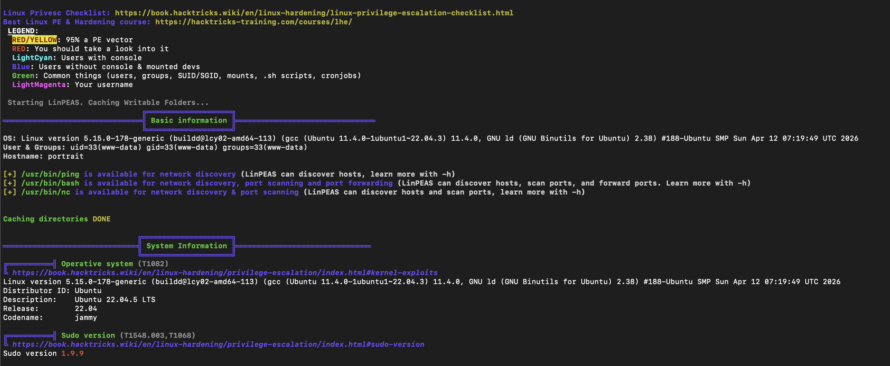

# Hasil LinPEAS 
## Contoh 1




╔══════════╣ Kernel Exploit Registry (T1068)
* Operating system ............. Linux
* Kernel release ............... 5.15.0-178-generic
* Comparable version ........... 5.15.0.178
* Data chunk limit ............. max 25 rows per KERNEL_CVE_DATA_* variable (1..22)
* Kernel config source ......... /boot/config-5.15.0-178-generic

```bash
CVE: CVE-2022-0847 | Name: DirtyPipe | Match data: pkg=linux-kernel,ver>=5.8,ver<=5.16.11 | Tags: ubuntu=(20.04|21.04),debian=11 | Rank: 1
CVE: CVE-2022-0995 | Name: watch_queue | Match data: pkg=linux-kernel,ver>=5.8,ver<5.16.5,x86_64 | Tags: ubuntu=21.10{kernel:5.13.0.37-generic} | Rank: 1 | Details: Not 100% reliable, may need to be run a couple of times. It rare cases it may panic the kernel.
CVE: CVE-2022-2586 | Name: nft_object UAF | Match data: pkg=linux-kernel,ver>=5.12,ver<5.19,CONFIG_USER_NS=y,sysctl:kernel.unprivileged_userns_clone==1 | Tags: ubuntu=(20.04){kernel:5.12.13} | Rank: 1 | Details: kernel.unprivileged_userns_clone=1 required (to obtain CAP_NET_ADMIN)
CVE: CVE-2022-32250 | Name: nft_object UAF (NFT_MSG_NEWSET) | Match data: pkg=linux-kernel,ver<5.18.1,CONFIG_USER_NS=y,sysctl:kernel.unprivileged_userns_clone==1 | Tags: ubuntu=(22.04){kernel:5.15.0-27-generic} | Rank: 1 | Details: kernel.unprivileged_userns_clone=1 required (to obtain CAP_NET_ADMIN)
CVE: CVE-2023-0386 | Name: OverlayFS suid smuggle | Match data: pkg=linux-kernel,ver>=5.11,ver<=6.2,CONFIG_USER_NS=y,sysctl:kernel.unprivileged_userns_clone==1 | Tags: ubuntu=22.04.1{kernel:5.15.0-57-generic} | Rank: 1 | Details: CONFIG_USER_NS needs to be enabled && kernel.unprivileged_userns_clone=1 required
CVE: CVE-2026-46333 | Name: ptrace exit-race | Match data: pkg=linux-kernel,ver>=5.11,ver<5.15.207,cmd:[ "$(cat /proc/sys/kernel/yama/ptrace_scope 2>/dev/null || echo 0)" -lt 2 ] | Tags: 1 | Rank: Upstream issue introduced in 4.10; fixed in 5.15.207; mitigated by kernel.yama.ptrace_scope >= 2
Kernel vulns found: 6
```

╔══════════╣ Active Ports (T1049)
* https://book.hacktricks.wiki/en/linux-hardening/privilege-escalation/index.html#open-ports
* Active Ports (ss) (T1049)

```bash
tcp   LISTEN 0      4096      127.0.0.3%lo:53        0.0.0.0:*          
tcp   LISTEN 0      80            127.0.0.1:3306      0.0.0.0:*          
tcp   LISTEN 0      511                   *:80            *:*
```
        
*  Local-only listeners (loopback) (T1049)

```bash
tcp   LISTEN 0      80            127.0.0.1:3306      0.0.0.0:*
```
    
*  Unique listener bind addresses (T1049)

```bash
127.0.0.1
127.0.0.3%lo
69.69.69.75%enp0s1
```

*  Potential local forwarders/relays (T1049)
www-data  201764  0.0  0.0   7044  1120 pts/2    S+   10:36   0:00 sed -E s,socat|ssh|-L|-R|-D|ncat|nc,?[1;31;103m&?[0m,g


## System Information

### Operative System (T1082)

> https://book.hacktricks.wiki/en/linux-hardening/privilege-escalation/index.html#kernel-exploits

```text
Linux version 5.15.0-178-generic (buildd@lcy02-amd64-113)
gcc (Ubuntu 11.4.0-1ubuntu1~22.04.3) 11.4.0
GNU ld (GNU Binutils for Ubuntu) 2.38
#188-Ubuntu SMP Sun Apr 12 07:19:49 UTC 2026

Distributor ID: Ubuntu
Description: Ubuntu 22.04.5 LTS
Release: 22.04
Codename: jammy
```

---

### Sudo Version (T1548.003, T1068)

> https://book.hacktricks.wiki/en/linux-hardening/privilege-escalation/index.html#sudo-version

```text
Sudo version 1.9.9
```

---

### PATH (T1574.007)

> https://book.hacktricks.wiki/en/linux-hardening/privilege-escalation/index.html#writable-path-abuses

```text
/usr/local/sbin
/usr/local/bin
/usr/sbin
/usr/bin
/sbin
/bin
/snap/bin
```

---

### Date & Uptime (T1082)

```text
Date : Mon Jun 29 10:35:00 UTC 2026
Uptime: 1 hour 32 minutes

Load Average:
- 0.23
- 0.05
- 0.06
```

---

### Environment Variables (T1082, T1552.007)

```text
SHLVL=1
OLDPWD=/
LC_CTYPE=C.UTF-8
APACHE_RUN_DIR=/var/run/apache2
APACHE_PID_FILE=/var/run/apache2/apache2.pid
APACHE_LOCK_DIR=/var/lock/apache2
LANG=C
APACHE_RUN_GROUP=www-data
APACHE_RUN_USER=www-data
APACHE_LOG_DIR=/var/log/apache2
PWD=/tmp
```

---

## Protections (T1518.001)

| Feature | Status |
|---------|--------|
| AppArmor | Enabled |
| AppArmor Profile | unconfined |
| SELinux | Not Installed |
| Seccomp | Disabled |
| User Namespace | Enabled |
| unpriv_userns_clone | 1 |
| ASLR | Enabled |
| Cgroup v2 | Enabled |
| ptrace_scope | 1 |
| dmesg_restrict | 1 |
| kptr_restrict | 1 |
| Lockdown Mode | integrity / confidentiality |
| Virtual Machine | Oracle VM |

#### Kernel Hardening

```text
CONFIG_SLAB_FREELIST_RANDOM=y
CONFIG_SLAB_FREELIST_HARDENED=y
CONFIG_RANDOMIZE_BASE=y
CONFIG_STACKPROTECTOR=y
CONFIG_STACKPROTECTOR_STRONG=y
```

---

## Kernel Modules

### Loadable Modules

```text
Modules can be loaded
```

### Signature Enforcement

```text
Not enforced
```

---

## Kernel Exploit Registry

| CVE | Name | Status |
|-----|------|--------|
| CVE-2022-0847 | DirtyPipe | Match |
| CVE-2022-0995 | watch_queue | Match |
| CVE-2022-2586 | nft_object UAF | Match |
| CVE-2022-32250 | NFT_MSG_NEWSET | Match |
| CVE-2023-0386 | OverlayFS SUID Smuggle | Match |
| CVE-2026-46333 | ptrace exit-race | Match |

**Kernel vulnerabilities detected:** **6**

---

## Dirty Frag Check

### CVE-2026-43284

```text
LIKELY VULNERABLE
```

### CVE-2026-43500

```text
LIKELY VULNERABLE
```

#### Notes

- xfrm-ESP module autoloadable
- rxrpc module autoloadable
- No modprobe mitigation detected
- User namespaces enabled
- Kernel build predates upstream fix

#### Suggested Mitigations

- Disable esp4/esp6/rxrpc via `/etc/modprobe.d/`
- Disable unprivileged user namespaces
- Apply latest Ubuntu kernel patches
